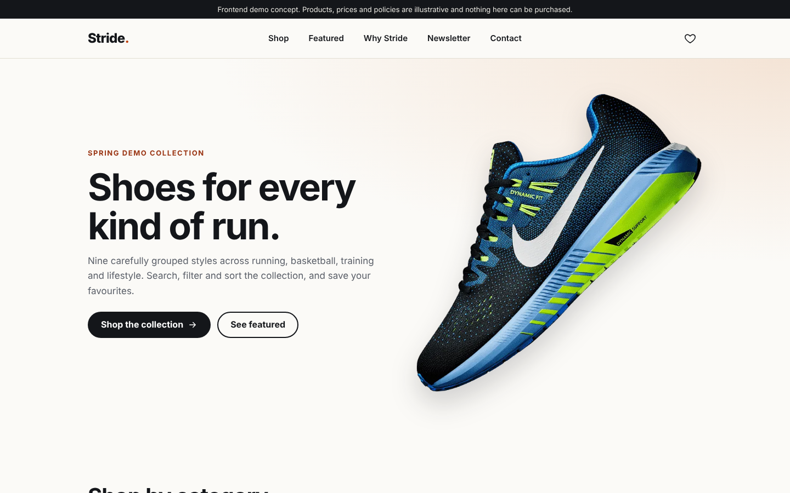
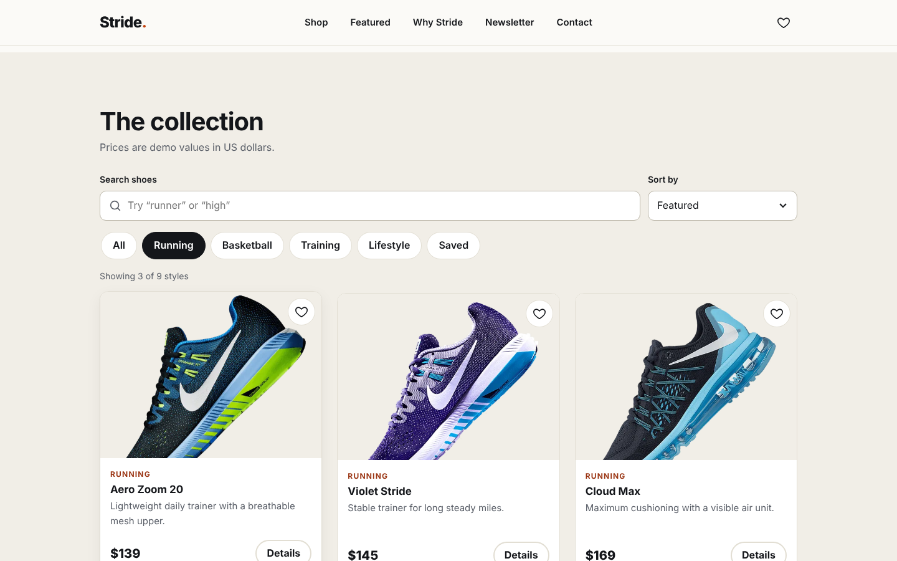
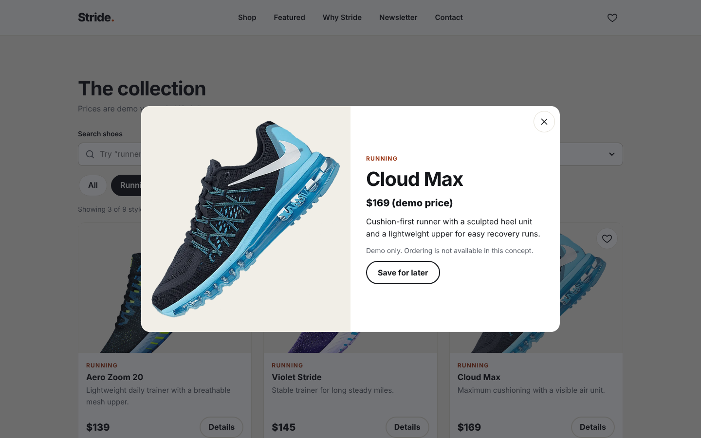
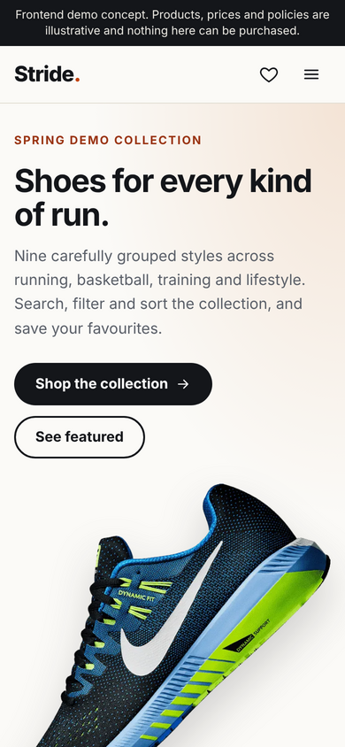
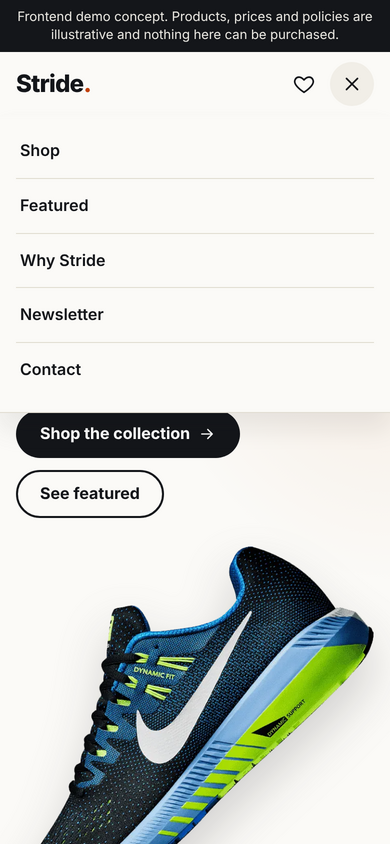
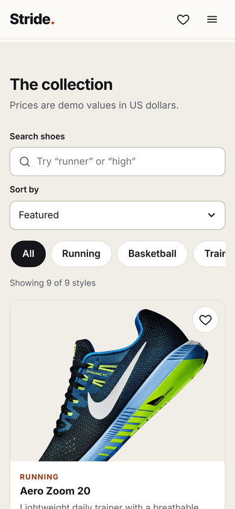

# Stride — Footwear Storefront Concept

A responsive, accessible footwear storefront built with plain HTML, CSS and JavaScript. It began as an early learning project (a single-page shoe shop) and has since been modernized into a portfolio-quality frontend concept.

**Live demo:** https://mohammedszd.github.io/shop-site/

> This is a frontend demo. There is no backend, no checkout and no real inventory. Products, prices and policies are illustrative.



## Features

- Responsive layout designed mobile-first, tested from 320px to 1920px
- Product collection with client-side **search**, **category filtering** and **sorting** (featured, price, name)
- **Save for later** on each product, persisted in `localStorage`, with a live count in the header
- Product **details dialog** built on the native `<dialog>` element
- Featured product with an accessible image gallery
- Accessible mobile menu (button state, Escape to close, closes on navigation)
- Newsletter form with client-side validation (nothing is stored or sent)
- Optimized local WebP imagery with explicit dimensions, `srcset` and lazy loading
- Inline SVG icons and a system font stack, so there are no third-party runtime dependencies

## Screenshots

| Collection | Product details |
| --- | --- |
|  |  |

| Mobile home | Mobile menu | Mobile collection |
| --- | --- | --- |
|  |  |  |

## Technology

- HTML5, CSS3 (custom properties, grid, flexbox), vanilla JavaScript (ES5-compatible syntax)
- No build step, no package manager, no dependencies
- Deployable as-is on GitHub Pages

## Run locally

Open `index.html` in a browser, or serve the folder:

```bash
python3 -m http.server 8000
# then visit http://localhost:8000
```

## Project structure

```
index.html          Page markup and product data (data-* attributes)
style.css           Design tokens, layout and components
script.js           Menu, search/filter/sort, saved items, dialog, gallery, form
assets/
  favicon.svg       Site icon
  og-image.jpg      Social sharing preview
  img/              Optimized WebP product images
docs/screenshots/   README screenshots
```

## Responsive design notes

- Styles are written for small screens first, then enhanced at 640px, 900px and wider breakpoints.
- The product grid goes from one column to two to three; category tiles go from two columns to four.
- Category chips scroll horizontally on narrow screens instead of wrapping into a tall block.
- Interactive controls are at least 44px tall for comfortable touch use.
- Checked at 320, 375, 430, 768, 1024, 1440 and 1920px with no horizontal overflow or broken images.

## Accessibility and performance

- Semantic landmarks, one `h1`, logical heading order and a skip link
- Visible focus states, labelled form controls and `aria-pressed` / `aria-expanded` states
- Live region announces the number of results after filtering
- `prefers-reduced-motion` support
- Images were reduced from roughly 10 MB of PNG/JPG to about 1 MB of WebP; the hero image is preloaded and below-the-fold images are lazy-loaded
- Open Graph metadata, canonical URL and favicon

## What changed from the original

The original project was a single page with placeholder Lorem Ipsum text, a non-functional login form, fake customer reviews, a Font Awesome CDN dependency and large unoptimized images. The git history of that earlier version is preserved. This update:

- Rewrote the content around a coherent fictional store concept
- Removed the non-functional login form and fabricated reviews and ratings
- Replaced the icon CDN with inline SVG
- Replaced the fixed-pixel desktop layout with a responsive one
- Added search, filtering, sorting, saved items and the details dialog

## Known limitations

- Demo only: there is no cart, checkout, payment or account system.
- Product photography is carried over from the original project and shows third-party brand marks. It is used for illustration, remains the property of its owners, and should be replaced with licensed or original imagery before any real use.
- Prices, shipping and returns policies, and the contact email (`example.com`) are placeholders.
- The product catalog lives in the HTML; a real store would load it from an API or CMS.
- Saved items are stored per browser only.

## Future improvements

- Load the catalog from a JSON file and render cards from it
- Add original or licensed product photography
- Add a size selector and a client-side cart demo
- Add automated accessibility and visual regression checks in CI
